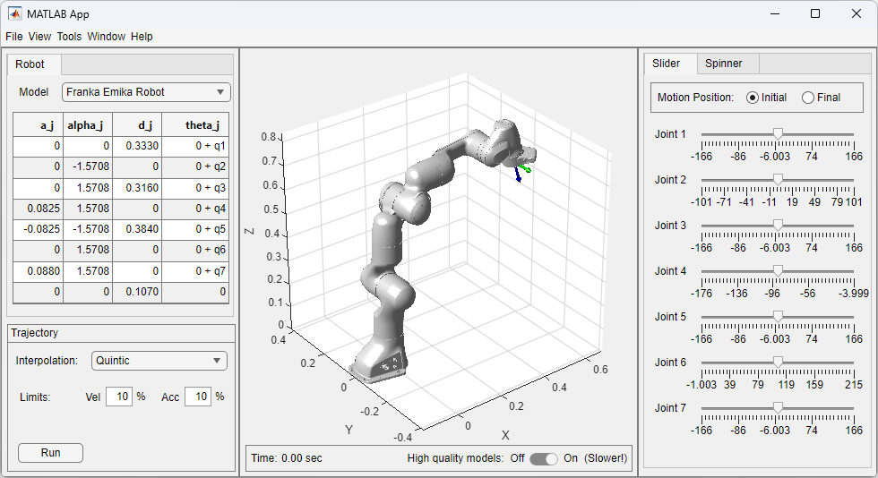
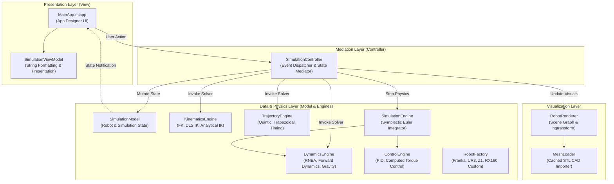

# Robot Simulation MATLAB GUI

[](https://github.com/mertcan-kaya/robot-simulation-matlab-gui/actions/workflows/ci.yml)
[](https://www.mathworks.com/products/matlab.html)
[](releases/Robot_Simulation_GUI.mltbx)
[](LICENSE)

A modern, high-performance object-oriented **MATLAB App Designer** platform and standalone robotics toolbox for 3D modeling, kinematics, dynamics, trajectory planning, and control simulation of serial robotic manipulators.



---

## 🌟 Key Features

* **3D Visual Simulation**:
  * Real-time 3D rendering with CAD STL meshes.
  * Hierarchical forward transformations using optimized `hgtransform` scene graphs for maximum framerates.
  * Interactive coordinate frame visualization (Base, Joints, Flange, Tool/End-Effector).
  * Ghost robot rendering for initial/target configuration visualization.
  * Real-time end-effector path tracing.

* **Multi-Robot Support & Custom Modeling**:
  * Pre-configured industrial and collaborative robots (Franka Emika Panda, Universal Robots UR3, Unitree Z1, Stäubli RX160 / RX160L).
  * **Custom Robot Designer**: Define arbitrary $N$-DoF serial manipulators with user-specified Denavit-Hartenberg (DH) parameters, mass properties, inertias, and revolute/prismatic joints.

* **High-Performance Kinematics Engine**:
  * Forward Kinematics (FK) with configurable Euler angle conventions (ZYZ, ZYX, XYZ).
  * Robust Inverse Kinematics (IK):
    * **Damped Least-Squares (DLS / Levenberg-Marquardt)** with adaptive singularity damping.
    * **Analytical Closed-Form IK** for 6-DoF spherical wrist manipulators (UR3, RX160).
    * **Hybrid Geometric IK** and Jacobian Transpose methods.
  * Joint position and task-space safety bounding.

* **Trajectory Planning**:
  * Point-to-point interpolation profiles:
    * **Linear** ($C^0$ continuous)
    * **Cubic Polynomial** ($C^1$ smooth)
    * **Quintic Polynomial** ($C^2$ smooth, continuous jerk)
    * **Trapezoidal Velocity** (Bang-bang acceleration)
  * Dynamic computation of minimum execution time ($t_{\text{fin}}$) satisfying joint velocity and acceleration constraints.

* **Physics, Dynamics & Control Simulation**:
  * Recursive Newton-Euler Algorithm (RNEA/ABA) for high-frequency forward & inverse dynamics.
  * **Symplectic Euler Integrator** ensuring numerical stability in non-smooth friction regimes.
  * **Computed Torque Control (Inverse Dynamics Control / IDC)**.
  * **Joint PID Control** with anti-windup.
  * **Analytical Gravity Compensation**.
  * Nonlinear joint friction modeling (Viscous, Coulomb, Stribeck, and FER empirical models).
  * Passive joint spring stiffness modeling.

* **Clean Object-Oriented Backend (`+robotics`)**:
  * Strict Model-View-Controller (MVC) architecture.
  * 100% headless backend usable directly in custom scripts, batch simulations, and CI pipelines without launching the GUI.

---

## 🤖 Supported Robots

| Robot Model | Manufacturer | DoF | Joint Types | Features |
| :--- | :--- | :---: | :---: | :--- |
| **Franka Emika Panda** | Franka Robotics | 7 | Revolute | 7-DoF redundant arm with optional 2-finger parallel gripper |
| **Universal Robots UR3** | Universal Robots | 6 | Revolute | 6-DoF collaborative manipulator with analytical IK |
| **Unitree Z1** | Unitree | 6 | Revolute | Lightweight dexterous robotic arm |
| **Stäubli RX160** | Stäubli | 6 | Revolute | High-precision industrial manipulator |
| **Stäubli RX160L** | Stäubli | 6 | Revolute | Extended-reach industrial manipulator |
| **Custom Robot** | *User Defined* | $N$ | Rev / Prism | Fully configurable DH parameters, masses, and inertia tensors |

---

## 🏗️ Architecture Overview

The software is structured around a decoupled **Model-View-Controller (MVC)** design pattern, allowing the GUI and the computational engine to evolve independently:



---

## 🚀 Getting Started

### Prerequisites
* MATLAB R2020b or later.
* *(Optional)* MATLAB Unit Test Framework for running automated test suites.

### Installation Options

#### Option 1: MATLAB Toolbox Installation (Recommended)
1. Double-click [`releases/Robot_Simulation_GUI.mltbx`](releases/Robot_Simulation_GUI.mltbx) in MATLAB.
2. Click **Install**.
3. Launch the app by typing `MainApp` in the MATLAB Command Window or from the MATLAB **Apps** tab.

#### Option 2: Run from Source
1. Clone the repository:
   ```bash
   git clone https://github.com/mertcan-kaya/robot-simulation-matlab-gui.git
   ```
2. Open MATLAB and navigate to the repository directory.
3. Launch the GUI:
   ```matlab
   MainApp
   ```

---

## 💻 Headless API & Examples (`examples/`)

The core `+robotics` backend can be executed completely headlessly in standalone MATLAB scripts, batch parameter sweeps, or optimization routines:

### 1. Forward & Inverse Kinematics ([`demo_forward_kinematics.m`](examples/demo_forward_kinematics.m))
```matlab
% Instantiate a 7-DoF Franka Emika Panda
robot = robotics.models.RobotFactory.create(1);
kin = robot.getKinematicParameters(0);

% Forward Kinematics
q = [0; -pi/6; 0; -pi/3; 0; pi/2; pi/4];
T_chain = robotics.engines.KinematicsEngine.getTransMatrix(...
    eye(4), kin.a_j, kin.alpha_j, kin.d_j, kin.theta_O_j, kin.j_type, q);
p_EE = T_chain(1:3, 4, kin.n+2);

% Damped Least-Squares Inverse Kinematics
invConfig.inv_geo_trn = 1; invConfig.kp_trn = 0.5; invConfig.kr_trn = 0.5;
invConfig.TI_0 = eye(4);
q_target = robotics.engines.KinematicsEngine.inverseKinematics(...
    robot, invConfig, kin, eye(3), p_EE + [0.05; -0.05; 0.02], q);
```

### 2. Trajectory Generation & Dynamic Simulation ([`demo_trajectory_and_control.m`](examples/demo_trajectory_and_control.m))
```matlab
% Compute minimum duration satisfying velocity and acceleration limits
tfin = robotics.engines.TrajectoryEngine.computeTime(...
    q_start, q_goal, 0.80, 3, kin.q_velLim, kin.q_accLim);

% Generate smooth Quintic polynomial trajectory step
[q_k, qd_k, qdd_k] = robotics.engines.TrajectoryEngine.generateTrajectory(...
    trjConfig, kin, q_start, q_goal, step_idx);

% Calculate feedforward joint torques via Inverse Dynamics (MNEA/RNEA)
tau = robotics.engines.DynamicsEngine.inverseDynamicsMNEA(...
    kin, q_k, qd_k, qd_k, qdd_k, [0;0;-9.81], dyn.pj_j);
```

### 3. High-Throughput Performance Benchmark ([`benchmark_dynamics_performance.m`](examples/benchmark_dynamics_performance.m))
```matlab
% Benchmark zero-allocation 10 kHz forward dynamics and vectorized kinematics
benchmark_dynamics_performance
```

---

## 📁 Repository Structure

```
robot-simulation-matlab-gui/
├── .github/workflows/    # CI/CD Automated Test Runner
│   └── ci.yml
├── +robotics/            # Standalone Headless Robotics Package
│   ├── +engines/         # Dynamics, Kinematics, Control, Trajectory, Simulation
│   ├── +friction/        # Viscous, Coulomb, Stribeck, & FER Friction Models
│   ├── +graphics/        # 3D Scene Graph, MeshLoader, & Coordinate Axes
│   ├── +math/            # Vectorized SE(3), SO(3), Skew-Symmetric, & Euler Math
│   ├── +models/          # Polymorphic Robot Models (Franka, UR3, Z1, RX160, Custom)
│   ├── +trajectory/      # Trajectory Strategy Planners (Linear, Cubic, Quintic, Trap)
│   └── +viewmodels/      # UI ViewModel and String Formatting Layer
├── docs/                 # Documentation assets and architecture guides
│   ├── ARCHITECTURE.md   # Full Developer Architecture Specification
│   └── screenshot.png    # GUI Preview Screenshot
├── examples/             # Standalone Headless Scripts
│   ├── benchmark_dynamics_performance.m
│   ├── demo_forward_kinematics.m
│   └── demo_trajectory_and_control.m
├── meshes/               # CAD STL 3D models for link rendering
├── releases/             # Packaged MATLAB Toolbox (.mltbx) binaries
├── tests/                # Automated Unit Test Suite (8 Test Suites)
│   ├── TestDynamics.m
│   ├── TestInverseKinematics.m
│   ├── TestKinematics.m
│   ├── TestMainApp.m
│   ├── TestMeshCache.m
│   ├── TestRobotModels.m
│   ├── TestSpatialMath.m
│   └── TestTrjGeneration.m
├── MainApp.mlapp         # MATLAB App Designer Application
├── MainApp_code.txt      # Reference source code for App Designer Code View
├── package_toolbox.m     # Toolbox Packaging Automation Script
├── runAllTests.m         # Automated Test Suite Entry Point
└── README.md             # Project Documentation
```

---

## 🧪 Automated Testing

Run the full automated test suite from the MATLAB Command Window:

```matlab
runAllTests
```

The test framework executes 8 comprehensive test suites covering:
* **`TestRobotModels`**: Validates DH tables, inertial parameters, and joint limits across all models.
* **`TestKinematics`**: Validates forward kinematics chains and homogeneous transformation matrices.
* **`TestInverseKinematics`**: Tests analytical, DLS numerical, and hybrid IK convergence.
* **`TestDynamics`**: Validates RNEA forward dynamics, inverse dynamics, and gravity torques.
* **`TestSpatialMath`**: Tests $SE(3)$, $SO(3)$, Euler angles, and skew-symmetric matrix operations.
* **`TestTrjGeneration`**: Tests boundary conditions, continuity, and acceleration profiles.
* **`TestMeshCache`**: Validates STL caching and 3D graphics loading.
* **`TestMainApp`**: Validates UI state synchronization and mode switching.

---

## 📦 Building the MATLAB Toolbox

To generate a new `.mltbx` installer:

```matlab
package_toolbox
```

The installer will be generated in [`releases/Robot_Simulation_GUI.mltbx`](releases/).

---

## 📄 License

This project is licensed under the MIT License - see the [LICENSE](LICENSE) file for details.

## 👤 Author

**Mertcan Kaya**
* GitHub: [@mertcan-kaya](https://github.com/mertcan-kaya)
