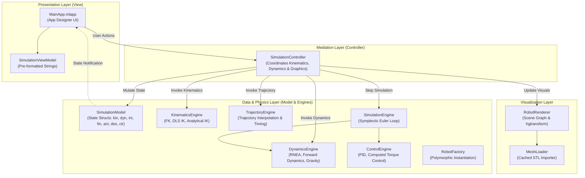

# Software Architecture & Developer Guide

This document outlines the architecture, design patterns, module interactions, and extension guidelines for the **Robot Simulation MATLAB GUI** framework.

---

## 1. Architectural Overview (MVC Pattern)

The codebase is built on a strict **Model-View-Controller (MVC)** architecture, decoupling physics, kinematics, and trajectory computations from the MATLAB App Designer UI.



---

## 2. Core Package Organization (`+robotics`)

All backend logic resides in the `+robotics` namespace:

### `+robotics/+models`
* **`RobotModel.m`**: Abstract base class defining interface methods (`getKinematicParameters`, `getJointLimits`, `getTaskLimits`, `getInertialParameters`, `getDefaultControlParams`, `computeInverseKinematics`, `invGeoNumeric`).
* **`RobotFactory.m`**: Factory pattern implementing `create(robot_model_id, customParams)` with defensive validation.
* **Robot Implementations**:
  * `FrankaEmika.m` (7-DoF)
  * `UR3.m` (6-DoF)
  * `UnitreeZ1.m` (6-DoF)
  * `StaubliRX160.m` & `StaubliRX160L.m` (6-DoF)
  * `CustomRobot.m` ($N$-DoF user-configured manipulator)
* **`SimulationModel.m`**: Central data model holding physics, simulation timing, and joint/task state structures.

### `+robotics/+engines`
* **`KinematicsEngine.m`**: Forward kinematics via Modified Denavit-Hartenberg (MDH) matrices, differential kinematics (Jacobians), and numerical/analytical inverse kinematics.
* **`DynamicsEngine.m`**: Vectorized Recursive Newton-Euler Algorithm (RNEA/MNEA/ANEA) forward and inverse dynamics computations, including analytical gravity torque calculation (`getTauG`).
* **`ControlEngine.m`**: Joint-level PID and Computed Torque Control (Inverse Dynamics Control / IDC) with gravity and friction compensation.
* **`TrajectoryEngine.m`**: Interpolation calculations, timing validation, and step-by-step state generation.
* **`SimulationEngine.m`**: Real-time simulation loops (`runKinematics` and `runDynamics`) using a Symplectic Euler numerical integrator.
* **`SimulationController.m`**: Central orchestrator mediating between `SimulationModel`, `SimulationEngine`, and `RobotRenderer`.

### `+robotics/+trajectory` (Strategy Pattern)
* **`TrajectoryPlanner.m`**: Abstract base strategy for trajectory generation.
* **Planners**:
  * `LinearPlanner.m`: $C^0$ linear trajectory.
  * `CubicPolynomialPlanner.m`: $C^1$ cubic spline.
  * `QuinticPolynomialPlanner.m`: $C^2$ smooth quintic polynomial.
  * `TrapezoidalVelocityPlanner.m`: Constant acceleration / deceleration profile.
* **`TrajectoryPlannerFactory.m`**: Instantiates planners by profile ID.

### `+robotics/+graphics`
* **`RobotRenderer.m`**: High-performance 3D scene renderer using MATLAB `hgtransform` objects to prevent full-axis redraw overhead during animations.
* **`MeshLoader.m`**: Caching loader for 3D STL CAD models from `meshes/`.
* **`PlotAxesManager.m`**: Viewport, lighting, axis limit, and grid management.

### `+robotics/+math`
* Pure, vectorized matrix utilities:
  * `SE3_SO3R3.m` / `SO3R3_SE3.m`: Homogeneous transformation decompositions.
  * `SkewSym.m`: Cross-product skew-symmetric matrices.
  * `SO3R3_R66_twist.m`: Spatial motion adjoint matrices.
  * `getRi_j.m`: Analytical MDH rotation matrix calculation.
  * `getEulerPosVec.m` / `getRotMatfromEA.m`: Euler angle translations across multiple conventions.

### `+robotics/+viewmodels`
* **`SimulationViewModel.m`**: Presentation layer providing pre-formatted string representations of states and dynamic limit strings for App Designer labels.

---

## 3. Key Design Patterns & Technical Innovations

### Factory Pattern (`RobotFactory`, `TrajectoryPlannerFactory`)
Isolates object instantiation logic from application callers. New robots and trajectory algorithms can be registered with zero modifications to the UI:

```matlab
robot = robotics.models.RobotFactory.create(robot_model_id);
planner = robotics.trajectory.TrajectoryPlannerFactory.create(trj_profile_id);
```

### Strategy Pattern (`TrajectoryPlanner`)
Encapsulates each trajectory interpolation profile into an interchangeable class implementing `computeTime` and `p2pTrj`.

### Hierarchical `hgtransform` Scene Graph
Rather than clearing and re-plotting geometry on every simulation timestep ($O(N \cdot M)$ vertices), links are loaded once into an `hgtransform` tree and updated by setting the `Matrix` property:

```matlab
set(obj.linkTransforms(j), 'Matrix', T(:,:,j));
```

### Damped Least-Squares (DLS) Inverse Kinematics
Regularized numerical inverse kinematics preventing velocity spikes near kinematic singularities:
$$J_{\text{DLS}} = J^T (J J^T + \lambda^2 I_6)^{-1}$$

### Symplectic Euler Numerical Integrator
Simulates forward multi-body dynamics at $10\text{ kHz}$ ($0.1\text{ ms}$) while preserving energy and numerical stability under non-smooth Coulomb and Stribeck friction:
$$\dot{q}_{k+1} = \dot{q}_k + \Delta t \, \ddot{q}(q_k, \dot{q}_k, \tau_k), \quad q_{k+1} = q_k + \Delta t \, \dot{q}_{k+1}$$

---

## 4. How to Add a New Robot Model

To add a new robot model (e.g., `KukaLBR`):

1. **Create the Model Class**:
   Create `+robotics/+models/KukaLBR.m` inheriting from `robotics.models.RobotModel`:
   ```matlab
   classdef KukaLBR < robotics.models.RobotModel
       properties
           Name = 'KUKA LBR iiwa'
       end
       methods
           function kin = getKinematicParameters(obj, ee_att)
               % Define DH table, joint types (1 for rev, 0 for prism)
           end
           function [q_posLim, q_posSafeLim, q_velLim, q_velSafeLim, q_accLim] = getJointLimits(obj)
               % Return Nx2 limit arrays
           end
           function [t_posLim, t_posSafeLim, t_velLim, t_velSafeLim, t_accLim] = getTaskLimits(obj, DH)
               % Return task space limits
           end
           function dyn = getInertialParameters(obj)
               % Return link masses, center of mass vectors, and inertia tensors
           end
           function ctr = getDefaultControlParams(obj, algo_id)
               % Return default PID/IDC gains
           end
       end
   end
   ```

2. **Register in Factory**:
   Add a case in `+robotics/+models/RobotFactory.m`:
   ```matlab
   case 6
       robot = robotics.models.KukaLBR();
   ```

3. **Add 3D Meshes**:
   Place corresponding `.stl` link files inside `meshes/KukaLBR/`.

4. **Add Unit Tests**:
   Add the class name to `ExpectedClasses` in [`tests/TestRobotModels.m`](../tests/TestRobotModels.m).
